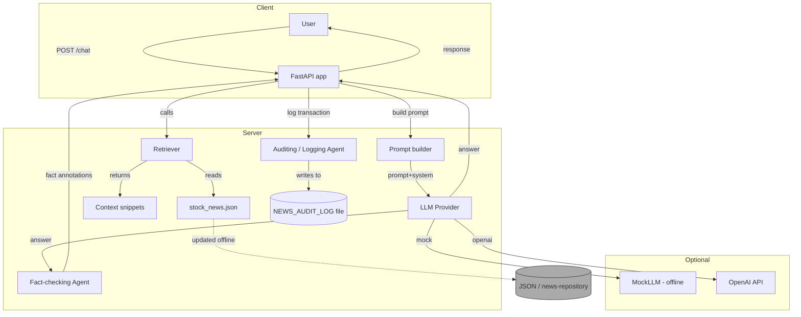
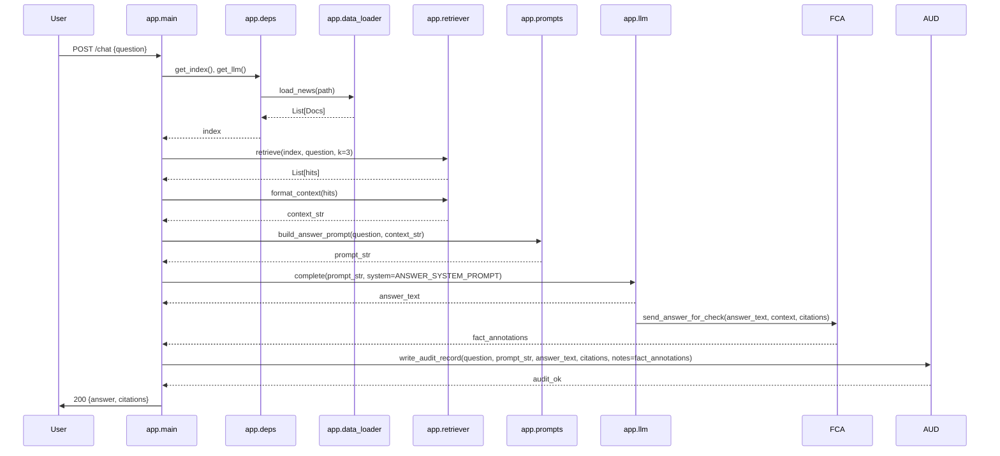
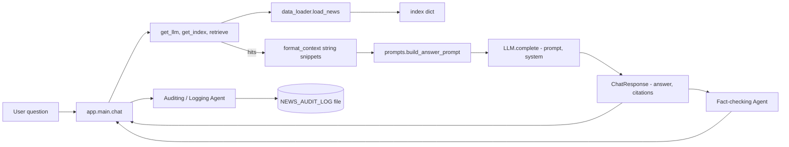
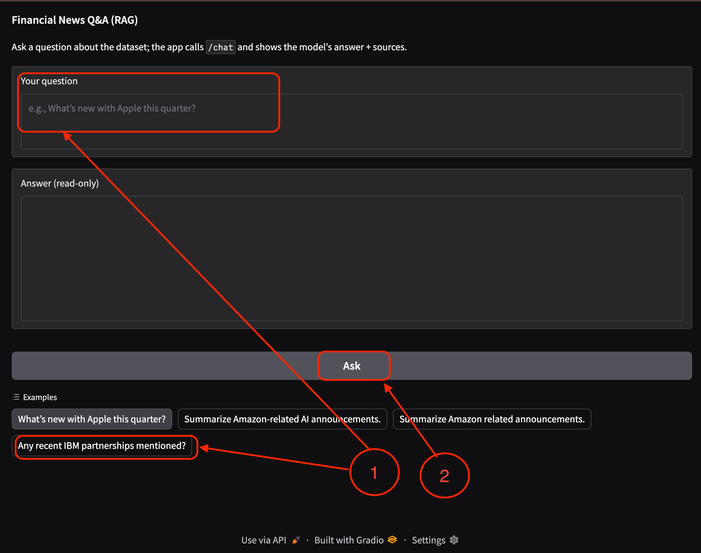
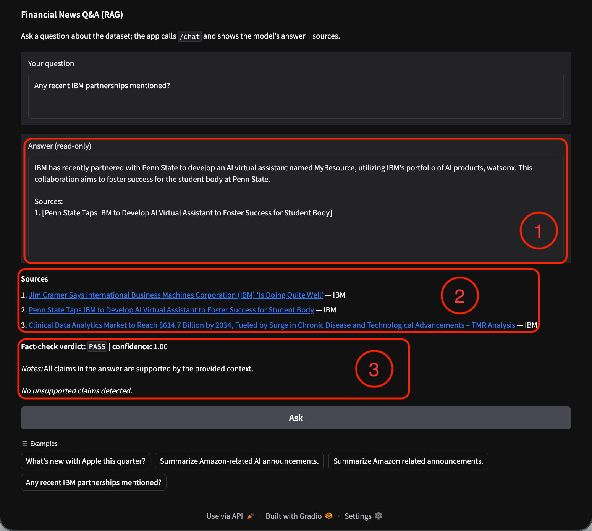
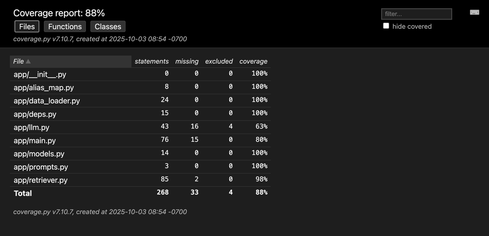
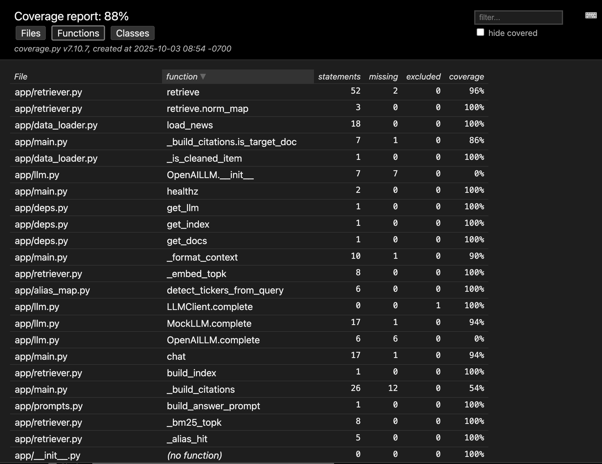

# Financial News RAG Chat — Local Runner

A minimal lightweight Retrieval-Augmented Generation RAG app (FastAPI + Gradio UI) that answers questions about a financial-news JSON file. Designed for deterministic offline testing and optional live usage with OpenAI.

TL;DR

This README is organised to help contributors and users: Architecture & Data flow → Quickstart → Run → Incremental checks → Testing → Contributing & Troubleshooting.

## Table of contents
- Overview
- Understand the dataset: field reference
- Architecture & Data flow
  - High-level architecture
  - Request Lifecycle
  - Module-level Data Flow
  - Prompt Guardrail used
- AI Agents & Auditing
- Quickstart (env & install)
  - Local setup without Containers
    - Running the app (mock / OpenAI)
    - Run Gradio UI
  - Using Docker
    - UI container
    - API container
- Data Cleaning
- Incremental checks & manual probes
- Testing (unit & functional)
- Contributing
- Troubleshooting
- License

## Overview

The application implements a simple pipeline:
- Load a JSON dataset of news articles (`stock_news.json`).
- Build a tiny deterministic index and retrieve the top-k relevant snippets for a user question.
- Build a prompt with system instructions + retrieved context and call a pluggable LLM.
- Return the model answer and a small list of citations.

Key files:
- `app/` — source modules
- `stock_news.json` — dataset
- `tests/` — pytest tests

## Understand the dataset: field reference
Financial news feed document (JSON) structure:
Never assume the data is clean and build processes to perform data checks and cleaning as needed.

- `stock_news.json`: mapping `ticker -> List[Article]` where `Article` may contain `title`, `link`, `full_text`.
- `Doc` (normalized): `{"id","ticker","title","link","text","order_index"}`
- `Index` (current): `{"docs": List[Doc]}`
- `Hit`: a `Doc` present in the top-k retrieval results
- `Context`: formatted string produced by `format_context` with snippets and `(link: URL)` markers
- `Prompt`: a string combining `SYSTEM` + `USER QUESTION` + `CONTEXT`
- `ChatResponse`: response model returned by the API with `answer` and `citations` (Citation has `title`, `link`, `ticker`)


## Architecture

High-level architecture:



### Request Lifecycle



### Module-level Data Flow



### Prompt Guardrail used
```plaintext
You are a careful financial-news assistant.
Answer ONLY using the provided CONTEXT. Do not use external knowledge.
When a list of sources is provided in CONTEXT, you MUST include a Sources section that
lists only the relevant sources to the user query. Format the Sources in order relevant to the user question numbered list (1., 2., 3.) with each entry containing: Title — Link.

Requirements:
- Be concise (≤500 words) in the main answer.
- Prefer precise, recent facts and include a short quote (≤50 words) from the CONTEXT
    when asserting facts such as numbers, dates, or named entities.
- If the CONTEXT lacks the answer, reply exactly: "I don’t know based on the provided (cleaned) news dataset."
- Do NOT fabricate, guess, or use external knowledge beyond the provided CONTEXT.
```

## AI Agents & Auditing

This project now includes optional AI agents that extend the RAG pipeline and a lightweight auditing agent that records user interactions and model predictions to a file set by the `NEWS_AUDIT_LOG` environment variable.

- Fact-checking agent: an auxiliary agent that runs after the primary LLM answer to verify key factual claims (dates, numbers, named entities) against the provided `CONTEXT` and the retrieved documents. If a mismatch is detected the agent annotates the response with a short "Fact-check" note and flags the item for reviewer attention. This agent uses the same `CONTEXT` and `citations` the main pipeline provides — it does not access external sources by default.

- Auditing / Logging agent: a second agent that writes each user transaction to the configured audit log. The log path is provided by the `NEWS_AUDIT_LOG` environment variable. Each record is a single JSON object (newline-delimited JSON) with a minimal, non-sensitive snapshot of the request and the pipeline output. Example fields:

  - `ts`: ISO8601 timestamp (UTC) for the transaction
  - `question`: the raw user question (redaction rules described below)
  - `prompt`: the prompt sent to the LLM (sanitized)
  - `model`: model identifier used (e.g., `mock` or `gpt-4o-mini`)
  - `answer`: model text output
  - `citations`: list of citation dicts returned by the retrieval pipeline (title/link/ticker)
  - `notes`: optional fact-checker annotations (if any)

Example minimal log line (one JSON object per line):

```json
{"ts":"2025-10-11T15:04:05Z","question":"Any recent IBM partnerships mentioned?","model":"gpt-4o-mini","answer":"...","citations":[{"title":"Penn State Taps IBM...","link":"https://...","ticker":"IBM"}],"notes":"fact-check: date mismatch"}
```

Enabling audit logs (local/run example):

```bash
export NEWS_AUDIT_LOG=./logs/interactions.log
mkdir -p $(dirname "$NEWS_AUDIT_LOG")
export LLM_PROVIDER=mock
export NEWS_JSON_PATH=stock_news.cleaned.json
PYTHONPATH=. uvicorn app.main:app --reload
```

Security and privacy notes
- Do NOT store secrets (API keys, PII) in the audit log. The auditing agent automatically redacts patterns that look like API keys / private keys (configurable regex). Review and tune `NEWS_AUDIT_LOG` permissions (owner-only) and rotation policies.
- The audit log is newline-delimited JSON for easy ingestion by log processors; choose retention/rotation appropriate to your environment.
- To disable logging entirely, unset `NEWS_AUDIT_LOG` or set it to an empty value.

If you want the agent to upload logs to a remote store (S3, ELK, etc.) this can be added later; the current implementation writes to a local file for simplicity and offline debugging.


## Quickstart (env & install)

### Local setup (without Containers)

1. Create and activate a virtualenv
```bash
python -m venv .venv
source .venv/bin/activate

# alternate using uv
uv venv .venv
source .venv/bin/activate
```

2. Install dependencies
```bash
pip install -r requirements.txt

# alternate using uv
uv pip install -r requirements.txt
```

3. Run the (offline) tests with PYTHONPATH set so the `app` package is importable:
```bash
PYTHONPATH=. pytest -q
```

### Running the app

1) Mock LLM (no external keys)

> Create a sample run.sh file
```bash
export NEWS_AUDIT_LOG=./logs/interactions.log
export LLM_PROVIDER=mock
export NEWS_JSON_PATH=stock_news.cleaned.json
uvicorn app.main:app --reload
PYTHONPATH=. pytest -q
```

```bash
bash run.sh
# or
PYTHONPATH=. uvicorn app.main:app --reload
```

2) OpenAI LLM (requires API key)

> Create a sample run-openai.sh file

```bash
export NEWS_AUDIT_LOG=./logs/interactions.log
export LLM_PROVIDER=openai
export NEWS_JSON_PATH=stock_news.cleaned.json
export OPENAI_API_KEY="sk-..."
export OPENAI_MODEL=gpt-4o-mini
PYTHONPATH=. uvicorn app.main:app --reload
```

**NOTE:** Please provision your own OpenAI Key, can be obtained at https://platform.openai.com/ and assign it to the environment variable `OPENAI_API_KEY`.

Also note; you can choose to use a model other than `gpt-4o-mini` from OpenAI catalog of models, however the code has been validated with `gpt-4o-mini`


```bash 
bash run-openai.sh
```

Visit http://127.0.0.1:8000/docs to try the `/chat` endpoint interactively.

#### CURL based invocation

Use the CURL CMD listed below to execise the `/chat` endpoint from the command line:

```bash

curl http://localhost:8000/healthz

curl -X POST http://localhost:8000/chat -H "Content-Type: application/json" -d '{"question": "What is the news on Apple?"}'

curl -X POST http://localhost:8000/chat -H "Content-Type: application/json" -d '{"question": "What is the news on Nvidia?"}'

curl -X POST http://localhost:8000/chat -H "Content-Type: application/json" -d '{"question": "What is the news on Intel?"}'
```

Use your own questions as desired, note those questions will only be answered based on the JSON dataset and not from public sources, infact tooling explicitly denies usage of other sources

### Run Gradio UI

```bash
export NEWS_API_BASE=http://localhost:8000
python ui/app.py
```
<!-- Add the Gradio UI examples screenshot here -->


_Figure - 1: User input instructional steps._



_Figure - 2 : Sample response with reference pointer to sources._


## Docker / local container setup

### UI container 

#### requirements
- Docker or Colima (macOS/Linux)
```bash
gradio>=3.0
requests>=2.28
```

#### Build:

```bash
# build image named fin-news-rag-ui:local
docker build -f docker/ui/Dockerfile -t fin-news-rag-ui:local .
```

#### Run:

```bash
# run with NEWS_API_BASE pointing at localhost:8000 on the host (for now; API not required)
docker run --rm -p 7860:7860 -e NEWS_API_BASE=http://host.docker.internal:8000 fin-news-rag-ui:local
```

**Notes:**
- host.docker.internal resolves from macOS Docker to the host; if using Colima it should be available, otherwise use the API container name when using compose (like http://api:8000).
- Watch logs printed on startup; Gradio should print the local + network URL (e.g., http://0.0.0.0:7860).

### API container
#### requirements
- Docker or Colima (macOS/Linux)
- OpenAI key (if using OpenAI LLM)

#### Build:

```bash
docker build -f docker/api/Dockerfile -t fin-news-rag-api:local .
```

#### Run:

- Run with mock LLM (no external keys needed)
```bash

docker run --rm -p 8000:8000 \
  -e LLM_PROVIDER=mock \
  -e NEWS_JSON_PATH=/stock_news.cleaned.json \
  -v "$(pwd)/stock_news.cleaned.json":/stock_news.cleaned.json:ro \
  fin-news-rag-api:local
```

- Run with OpenAI LLM (requires OpenAI API key)
```bash

docker run --rm -p 8000:8000 \
  -e NEWS_JSON_PATH=/stock_news.cleaned.json \
  -e LLM_PROVIDER=openai \
  -e OPENAI_API_KEY="sk-..."  \
  -e OPENAI_MODEL=gpt-4o-mini \
  -v "$(pwd)/stock_news.cleaned.json":/stock_news.cleaned.json:ro \
  fin-news-rag-api:local
```

**Notes:**
- The `NEWS_JSON_PATH` env var points to the JSON file inside the container; we mount the local cleaned JSON file as read-only.
- The `LLM_PROVIDER` can be `mock` (default) or `openai`.
- The `OPENAI_API_KEY` should be your own key from https://platform.openai.com/.
- The `OPENAI_MODEL` can be set to a different model if desired; the code has been validated with `gpt-4o-mini`.


## Data Cleaning

```bash
python /mnt/data/clean_news_dataset.py --in stock_news.json \
  --out-clean stock_news.cleaned.json \
  --out-filtered stock_news.filtered.for_index.json \
  --report stock_news_label_report.csv
```

**NOTE:** file `data_cleanup/stock_news.cleaned.json` is used as input to the RAG.

## Testing & coverage

This project includes unit and lightweight functional tests. The `MockLLM` and small retriever keep tests deterministic so you can run them offline.

1) Install test tooling (once)
```bash
# inside your venv
pip install pytest pytest-cov
```

2) Run focused tests (fast)
```bash
PYTHONPATH=. pytest tests/test_api.py -q
```

3) Run the full test suite
```bash
PYTHONPATH=. pytest -q
```

4) Run tests with coverage and generate reports (terminal + HTML)
```bash
PYTHONPATH=. pytest --cov=app --cov-report=term-missing --cov-report=html -q
```

What the coverage command produces:
- A terminal summary showing overall coverage and per-file percentages; `term-missing` prints missing line numbers for files.
- An `htmlcov/` directory with an HTML report you can open in a browser (`open htmlcov/index.html` or `python -m http.server --directory htmlcov 8000`).

5) Fail the test run on low coverage (optional: set the threshold as desired)
```bash
PYTHONPATH=. pytest --cov=app --cov-report=term --cov-fail-under=80 -q
```

How to read and act on the reports
- Start with the overall coverage % (TOTAL). Then inspect per-file rows in the terminal output or open `htmlcov/index.html`.
- Click on files in the HTML report to see annotated source (green covered, red missing). Prioritize files with low % and large red blocks.

Tests and functional checks currently present
- `tests/test_api.py` — functional tests using FastAPI `TestClient` (healthz, empty question, mock-llm chat). This exercises `app.main` routing and wiring.
- `tests/test_retriever.py` (suggested) — unit tests for `app.retriever.retrieve` and `format_context` (not currently present: consider adding).
- `tests/test_prompts.py` (suggested) — unit tests for `app.prompts.build_answer_prompt` and `ANSWER_SYSTEM_PROMPT`.
- UI tests (suggested): tests for `ui/app.py`'s `ask_news` behavior (successful parse, HTTP error handling, network exceptions).

Suggested short workflow to increase coverage
1. Run coverage to identify lowest-covered files.
2. Add focused unit tests for those files (happy path + 1-2 edge cases each).
3. Re-run coverage and iterate until coverage goals met.

Example commands to open the HTML report
```bash
# macOS
open htmlcov/index.html

# or serve locally
python -m http.server --directory htmlcov 8000
# then browse http://127.0.0.1:8000
```

### Code coverage report



_Figure - 3: Current test coverage snapshot (generated via pytest-cov → htmlcov)._




_Figure - 4: Current test coverage snapshot (generated via pytest-cov → htmlcov)._

## Contributing

PRs welcome. Small things that help:
- Add unit tests under `tests/` when adding features.
- Keep `format_context` output compact (< 220 chars per snippet) so prompts remain small.

## Troubleshooting

- `ModuleNotFoundError: No module named 'app'`: run pytest or scripts with `PYTHONPATH=.` from the repo root.
- `OpenAILLM` errors: ensure `openai` SDK is installed and `OPENAI_API_KEY` is set.

## MIT License

This repository is an educational example. Use and adapt freely.
